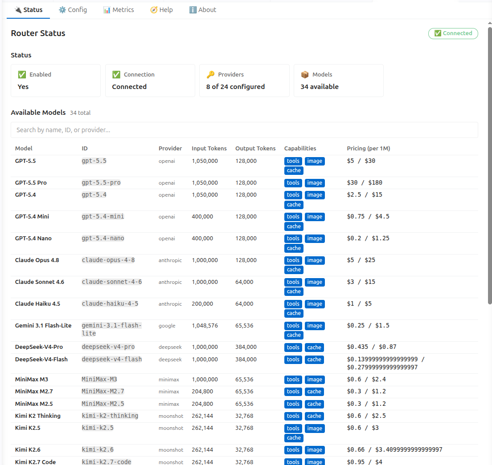
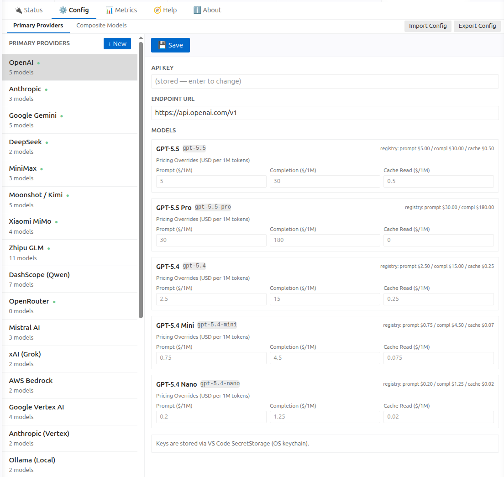
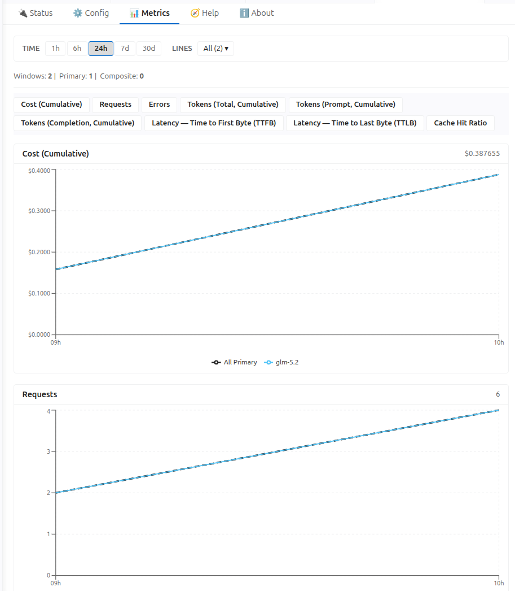

# LLM Local Router

A VS Code extension that provides **direct access to multiple LLM providers** with **composite model failover** — self-contained, no external router service required.

It registers as a **standard VS Code Language Model provider**, so the models show up in
**GitHub Copilot Chat** and in **any** extension that calls `vscode.lm` — you bring your own
API keys, and requests go **straight from your editor to the provider**. No proxy, no gateway
service, no account with anyone in the middle. It is not tied to any particular chat UI or
agent.



*Status — live connection state, how many providers are keyed, and every model exposed to `vscode.lm` with its capabilities and pricing.*



*Config — key each provider, override per-model pricing, and import/export the whole config. Keys are held in VS Code SecretStorage.*



*Metrics — cost, requests, errors, tokens, TTFB/TTLB latency and cache-hit ratio per model, over 1h→30d.*

## Works with

The models are published through VS Code's Language Model API under the vendor `local`, so
anything that speaks that API can use them:

| Consumer | How |
|----------|-----|
| **GitHub Copilot Chat** | Pick the models from Copilot Chat's model picker |
| **Any VS Code extension** | `vscode.lm.selectChatModels({ vendor: "local" })` |
| **Your own code** | Same API — plus optional [side-channel commands](#consuming-from-another-extension) for pricing, capabilities and per-conversation cost |

This is a **provider, not a chat UI**. It adds models to the tools you already use rather than
asking you to switch to a new one, and it is **not specific to any single extension or agent**.

## Features

- **24 built-in providers, 72 models, + your own**: OpenAI, Anthropic, Google Gemini, DeepSeek, MiniMax, Moonshot/Kimi, Xiaomi MiMo, Zhipu GLM, DashScope/Qwen, Z.ai, Mistral, xAI/Grok, OpenRouter, Fireworks, SambaNova, Baseten, Requesty, Unbound, Vercel AI Gateway, AWS Bedrock, Google Vertex AI, Anthropic-on-Vertex — plus **local models** via Ollama and LM Studio, and **user-registered custom providers** (OpenAI-, Anthropic- or Google-compatible) through the UI
- **Composite models** (`local/*`): **Failover**, **weighted round-robin**, **lowest-latency**, and **highest-reliability** strategies across multiple underlying models with in-process health monitoring and throttling
- **Full protocol translation**: Anthropic Messages API ↔ OpenAI Chat Completions, MiniMax `<think>` tag handling, DeepSeek/Moonshot reasoning_content round-trip, Xiaomi max_completion_tokens remapping, Zhipu thinking toggle
- **Streaming**: SSE streaming for all providers with real-time tool call accumulation
- **Cost tracking**: Per-token pricing from the built-in model registry, per-conversation cost ledger
- **VS Code LM API**: Implements `LanguageModelChatProvider` (vendor `local`) so GitHub Copilot Chat and any extension using `vscode.lm` can consume the models
- **Metrics dashboard**: 9 charts on a single page — cost, requests, errors, tokens (total/prompt/completion), TTFB, TTLB, cache-hit ratio — over 1h→30d, with a categorized Primary/Composite model picker
- **Side-channel commands**: `llmLocalRouter.getModelPricing`, `llmLocalRouter.getModelCapabilities`, `llmLocalRouter.getRequestCost`
- **Secure API keys**: Stored via VS Code's `SecretStorage` API

## Requirements

- VS Code 1.104.0 or later (stock VS Code — no special build or flags)
- API keys for at least one supported provider

## Installation

Install **LLM Local Router** from the [VS Code Marketplace](https://marketplace.visualstudio.com/items?itemName=Shoferdev.llm-local-router)
or the [Open VSX Registry](https://open-vsx.org/extension/Shoferdev/llm-local-router)
(VSCodium, Cursor, Windsurf, Gitpod), or from the command line:

```bash
code --install-extension Shoferdev.llm-local-router
```

It runs on stock VS Code with **no flags and no special build**. VS Code 1.104 is
the floor because that is where `vscode.lm.registerLanguageModelChatProvider` — the
API it registers models through — was finalized.

Then run **LLM Local Router: Configure** from the Command Palette to add a provider
API key, and **LLM Local Router: Show Models** to confirm the models are exposed.
They become selectable to any LM consumer via
`vscode.lm.selectChatModels({ vendor: "local" })`.

### Building from source

To build and install the `.vsix` yourself:

```bash
git clone https://github.com/shofer-dev/llm-local-router.git
cd llm-local-router
npm ci                                     # extension-host dependencies
npm run compile                            # -> out/main.js
(cd webview-ui && npm ci && npm run build) # -> webview-ui/build (config + metrics UI)
npx @vscode/vsce package                   # -> llm-local-router-<version>.vsix
code --install-extension llm-local-router-<version>.vsix
```

The webview build is **not optional** — package without it and the configuration
panel ships as a "Webview not built" placeholder. On code-server, install with
`code-server --install-extension`.

## Supported Providers

24 providers ship with the extension. Each is keyed independently — configure only the ones you
use. The exact model list per provider is visible in **Config → Primary Providers**, and the
**Status** tab shows every model currently exposed.

| Provider | Key | Notes |
|----------|-----|-------|
| OpenAI | `openai` | gpt-5.x family |
| Anthropic | `anthropic` | claude-opus / sonnet / haiku |
| Google Gemini | `google` | native Gemini API path |
| DeepSeek | `deepseek` | reasoning_content round-trip |
| MiniMax | `minimax` | `<think>` tag extraction |
| Moonshot / Kimi | `moonshot` | reasoning_content round-trip |
| Xiaomi MiMo | `xiaomi` | max_completion_tokens remap |
| Zhipu GLM | `zhipu` | thinking toggle |
| Z.ai | `zai` | international / china coding lines |
| DashScope (Qwen) | `dashscope` | international endpoint |
| Mistral AI | `mistral` | |
| xAI (Grok) | `xai` | |
| OpenRouter | `openrouter` | catch-all for unknown model ids |
| Fireworks | `fireworks` | |
| SambaNova | `sambanova` | |
| Baseten | `baseten` | |
| Requesty | `requesty` | |
| Unbound | `unbound` | |
| Vercel AI Gateway | `vercel-ai-gateway` | |
| AWS Bedrock | `bedrock` | region + IAM keys |
| Google Vertex AI | `vertex` | project + region, or ADC |
| Anthropic (Vertex) | `anthropic-vertex` | project + region |
| **Ollama** | `ollama` | **local** — `http://localhost:11434/v1` |
| **LM Studio** | `lmstudio` | **local** — `http://localhost:1234/v1` |
| **Custom** | user-defined | any OpenAI-, Anthropic- or Google-compatible endpoint |

## Configuration

### Provider API Keys

API keys are stored securely using VS Code's `SecretStorage`. Use the VS Code command palette to set them:

1. Open Command Palette (`Ctrl+Shift+P`)
2. Run `LLM Local Router: Configure`
3. Go to **Config → Primary Providers** and enter your API keys

The extension reads keys from SecretStorage under the keys `llm-local-router.provider.{name}` (e.g., `llm-local-router.provider.openai`).

### Custom Primary Providers

Register your own LLM providers via the **Config → Primary Providers** tab → **+ New** button. Each custom provider needs:

- A unique **Provider ID** and display **Label**
- An **API Protocol**: OpenAI Compatible, Anthropic Compatible, or Google Compatible
- An **Endpoint URL** and **API Key**
- One or more **Model definitions** as JSON (id, name, contextLength, maxOutputTokens, imageInput, toolCalling, thinking)
- Optional default **Pricing** per 1M tokens

Custom provider metadata is stored in `settings.json` (`llmLocalRouter.customProviders`). API keys are stored in VS Code SecretStorage.

### Import / Export config

**Config → Import Config / Export Config** (top-right of the Config tab) moves the
whole router config as a single JSON file:

```json
{
  "apiKeys":   { "deepseek": "sk-...", "anthropic": "sk-ant-..." },
  "endpoints": { "deepseek": "https://api.deepseek.com" },
  "settings":  { "enabled": true }
}
```

Import writes keys/endpoints to `SecretStorage` and applies `llmLocalRouter.*`
settings, then refreshes the models — no reload needed. Unknown provider ids are
skipped and reported.

**Export never includes API key values**, only *which* providers are keyed (plus
endpoints, non-secret settings and live runtime state), so an exported file is safe
to share or commit. Re-enter keys after importing your own export.

`LLM Local Router: Import Config` in the Command Palette does the same thing (it
prompts for the file). Both are also callable programmatically —
`executeCommand('llmLocalRouter.importConfig', configOrPath)` imports silently,
and `executeCommand('llmLocalRouter.exportConfig')` returns the config object.

### Extension Settings

| Setting | Type | Default | Description |
|---------|------|---------|-------------|
| `llmLocalRouter.enabled` | boolean | `true` | Enable/disable |
| `llmLocalRouter.debug` | boolean | `false` | Debug logging |
| `llmLocalRouter.compositeModelsFile` | string | `""` | Path to composite-models.json |
| `llmLocalRouter.compositeModelsConfig` | string | `""` | Inline JSON for composite models |
| `llmLocalRouter.customProviders` | string | `""` | Inline JSON for custom providers |
| `llmLocalRouter.experimental.prometheusEndpoint` | boolean | `false` | Expose a Prometheus scrape endpoint on `127.0.0.1` (loopback-only, no auth; port via `LLM_LOCAL_ROUTER_METRICS_PORT`, default 30098) |

### Composite Models

Define `local/*` composite models via the **Config → Composite Models** tab, or in `llmLocalRouter.compositeModelsConfig`:

```json
{
  "local/code": {
    "strategy": "failover",
    "models": ["deepseek-v4-pro", "claude-sonnet-4-6", "gpt-5.5"],
    "throttling": { "maxConcurrent": 50, "requestsPerWindow": 100, "windowMinutes": 5 },
    "streamingTimeoutMs": 30000,
    "perAttemptTimeoutMs": 120000,
    "totalTimeoutMs": 600000,
    "health": {
      "failureThreshold": 3,
      "degradedThreshold": 1,
      "cooldownMs": 30000
    }
  },
  "local/balanced": {
    "strategy": "round_robin",
    "models": [
      { "id": "deepseek-v4-pro", "weight": 3 },
      { "id": "claude-sonnet-4-6", "weight": 1 }
    ],
    "streamingTimeoutMs": 30000
  },
  "local/fastest": {
    "strategy": "lowest_latency",
    "models": ["deepseek-v4-pro", "claude-sonnet-4-6", "gpt-5.5"],
    "latencyWindowMs": 600000
  },
  "local/most-reliable": {
    "strategy": "highest_reliability",
    "models": ["deepseek-v4-pro", "claude-sonnet-4-6", "gpt-5.5"],
    "latencyWindowMs": 600000
  }
}
```

**Strategies** (all of them fall over: each returns an ordered candidate list, so a model that fails before its first byte falls back to the next):
- **failover**: Tries models in strict order. On failure, falls back to the next.
- **round_robin**: Smooth weighted round-robin (nginx-style) — distributes requests proportional to model weights; remaining healthy models follow as failover candidates.
- **lowest_latency**: Picks the model with the lowest mean TTFB over a configurable sliding window (idle/stale models are not preferred), with the rest sorted behind it. Falls back to equal-weight round-robin on cold start.
- **highest_reliability**: Always picks the model with the highest success ratio over a configurable sliding window (`latencyWindowMs`). Falls back to equal-weight round-robin on cold start.

**Model entries** accept either a plain string (`"model-id"`) or an object with per-model overrides:
- `{ "id": "model-id", "weight": 5 }` — weight for round-robin (default: 1)
- `{ "id": "model-id", "throttling": {...} }` — per-model throttling overrides composite-level defaults

**Health monitoring** (three states, configurable via `health`):
- `healthy` → `degraded` after `degradedThreshold` consecutive failures (still usable)
- `degraded` → `unhealthy` after `failureThreshold` consecutive failures (quarantined)
- Unhealthy models are probed after `cooldownMs` (default: 30s)

**Timeouts:**
- `streamingTimeoutMs` — inactivity timeout for streaming (resets on each chunk, default: 30s)
- `perAttemptTimeoutMs` — hard deadline per attempt for non-streaming (default: 120s)
- `totalTimeoutMs` — total budget across all failovers (default: 300s)

**Capability intersection**: Composite models advertised via VS Code LM API report the minimum `maxInputTokens`/`maxOutputTokens` and the intersection of `imageInput`/`toolCalling`/`promptCache` across all underlying models — safe lower bounds that guarantee failover never hits a capability mismatch.

### Consuming from another extension

Any VS Code extension can consume these models through the standard LM API:

```ts
const models = await vscode.lm.selectChatModels({ vendor: "local" })
```

Consumers that want richer metadata than the LM API surfaces can call the
side-channel commands `llmLocalRouter.getModelPricing`,
`llmLocalRouter.getModelCapabilities`, and `llmLocalRouter.getRequestCost`
(see the [Architecture](#architecture) section below).

### Example: wiring it up in Shofer

[Shofer](https://shofer.dev) is one such consumer — the steps are the same for any extension that
speaks `vscode.lm`. In Shofer's **Settings → Providers**:

1. **API Provider** → **VS Code LM API**.
   *Not* "Shofer Router" — that is a different provider that points at a standalone HTTP router
   service over a Base URL. This extension has no HTTP endpoint; it publishes models through the
   VS Code LM API, so "VS Code LM API" is the one that sees it.
2. **Model** → pick any entry starting with `local/`. Shofer lists LM-API models as
   `vendor/family`, so everything this router publishes appears under the `local/` prefix
   (e.g. `local/gpt-5.5`). Hit **Refresh Models** if the list looks stale.
3. *Optional:* turn on Shofer's `enableLlmProviderIntegration` setting so it reads real pricing,
   capabilities and per-request cost from the router's side-channel commands instead of estimating
   them.

## Commands

- `LLM Local Router: Configure` — Open full configuration dashboard
- `LLM Local Router: Show Models` — View status and available models
- `LLM Local Router: Refresh Models` — Refresh the model list
- `LLM Local Router: Test Connection` — Test API key configuration
- `LLM Local Router: Show Metrics` — Multi-chart metrics dashboard
- `LLM Local Router: Show Model Stats` — Detailed statistics for a specific model
- `LLM Local Router: Export Metrics (Prometheus)` — Export in Prometheus text format
- `LLM Local Router: Show Composite Distribution` — Load-balancing distribution for composite models
- `LLM Local Router: Show Cost History` — Cost breakdown by model across a selected time range

## Metrics & Observability

Every chat completion request is automatically recorded with per-5-minute window aggregation covering:

- **Cost & tokens by model**: USD cost (from registry pricing), prompt/completion/cached tokens, cache hit ratio
- **Reliability**: TTFB/TTLB latency percentiles (p50/p90/p99), availability %, error-type breakdown
- **Composite load-balancing**: Which underlying model served how many requests, failover counts, attempts
- **Additional KPIs**: Throttle skips, per-window request volume

The webview **Metrics** tab shows all charts on a single page with anchor-link navigation and a categorized model picker that separates Primary from Composite models to prevent double-counting.


## Project Structure

```
extensions/llm-local-router/
├── src/
│   ├── main.ts                      # Extension entry point
│   ├── language-model-provider.ts   # VS Code LanguageModelChatProvider + cost ledger
│   ├── llm-client.ts                # HTTP client, SSE streaming, cost computation
│   ├── provider-client.ts           # Provider router + custom provider resolution
│   ├── composite.ts                 # Composite model failover/round-robin/lowest-latency/highest-reliability
│   ├── config-converter.ts          # Webview ↔ host config format conversion
│   ├── model-registry.ts            # All built-in model definitions + pricing
│   ├── metrics-collector.ts         # In-memory 5-min windowed metrics aggregation
│   ├── metrics-storage.ts           # SQLite persistence for metrics (debounced writes)
│   ├── metrics-server.ts            # Optional loopback Prometheus scrape endpoint
│   ├── health-checker.ts            # TCP keepalive provider connectivity monitor
│   ├── secret-storage.ts            # SecretStorage API key + custom provider wrapper
│   ├── router-config-provider.ts    # Webview panel host with message handling
│   ├── logger.ts                    # Structured logging
│   ├── types.ts                     # Shared TypeScript types
│   ├── __tests__/                   # Unit tests
│   └── providers/                   # Only providers needing request/response transforms have a file;
│       │                            # plain OpenAI-compatible ones (OpenRouter, Mistral, xAI, Ollama,
│       │                            # LM Studio, Fireworks, SambaNova, Baseten, Requesty, Unbound,
│       │                            # Vercel AI Gateway) share a no-op preparer in provider-client.ts.
│       ├── openai.ts                # GPT-5.x max_completion_tokens remapping
│       ├── anthropic.ts             # Messages API ↔ OpenAI translation
│       ├── google.ts                # Gemini native API (shared by Vertex)
│       ├── vertex.ts                # Vertex no-op preparer (routes through google.ts)
│       ├── bedrock.ts               # Bedrock (fails fast — not yet supported)
│       ├── deepseek.ts              # Reasoning_content round-trip
│       ├── minimax.ts               # <think> tag handling
│       ├── moonshot.ts              # Kimi reasoning content
│       ├── xiaomi.ts                # MiMo thinking injection
│       ├── zhipu.ts                 # GLM thinking toggle
│       └── zai.ts                   # Z.ai thinking toggle
├── webview-ui/
│   └── src/
│       ├── App.tsx                  # Tab routing (Status, Config, Metrics, Help)
│       └── components/
│           ├── ProvidersPanel.tsx    # Built-in + custom provider config
│           ├── CompositeEditor.tsx   # Composite model edition with latency UI
│           ├── CompositeList.tsx     # Composite model list with +New / 🗑
│           ├── ConfigEditor.tsx      # Two-panel config editor
│           ├── ConfigPanel.tsx       # Sub-tab bar (Primary Providers / Composite)
│           ├── MetricsPanel.tsx      # Multi-chart dashboard with categorized picker
│           ├── HelpPanel.tsx         # Usage guide
│           ├── StrategySelector.tsx  # failover / round_robin / lowest_latency / highest_reliability
│           └── ...
├── package.json
├── tsconfig.json
├── BUILD.bazel
├── README.md
└── DESIGN.md
```

## Architecture

```
VS Code LM consumer (e.g. Copilot Chat)
    │
    ├─ vscode.lm.selectChatModels({vendor:"local"})
    │    → LanguageModelProvider registers all models from registry + custom providers
    │
    ├─ client.sendRequest(messages, options)
    │    → ProviderRouter resolves model → built-in provider or custom provider
    │    → Custom providers: protocol-based handler factory
    │    → Provider-specific request preparation (Anthropic translation, etc.)
    │    → Direct HTTP/SSE call to provider API (OpenAI, Anthropic, etc.)
    │
    ├─ Composite models (local/*)
    │    → CompositeService: failover / round_robin / lowest_latency / highest_reliability
    │    → Windowed TTFB tracking per model (lowest_latency)
    │    → Success-ratio tracking per model (highest_reliability)
    │    → In-process health tracking + throttling
    │
    └─ Side-channel commands:
         llmLocalRouter.getModelPricing(modelId)    → Registry + custom provider pricing
         llmLocalRouter.getModelCapabilities(modelId) → Capabilities (incl. tool prefs)
         llmLocalRouter.getRequestCost(conversationId) → Per-conversation cost ledger
```

### Per-model tool preferences

Registry entries (`src/model-registry.ts`, `ModelRegistryEntry`) may declare
`includedTools` / `excludedTools` — the integrator-owned native-tool availability
and dialect/naming for that model (or inherit provider-family defaults via
`resolveModelToolPrefs` in `src/llm-client.ts`, e.g. OpenAI → `apply_patch`). The
VS Code `LanguageModelChatInformation.capabilities` type cannot carry arbitrary
arrays, so these ride the `llmLocalRouter.getModelCapabilities` side-channel (in
the `ModelCapabilities` payload). A consuming extension reads them and maps them
onto its own per-model tool metadata.

## Roadmap

See [ROADMAP.md](ROADMAP.md) for where this is going — and what it deliberately
won't become (no chat UI, no hosted gateway, no telemetry).

## License

AGPL-3.0 — see [LICENSE](LICENSE) for the full text.
